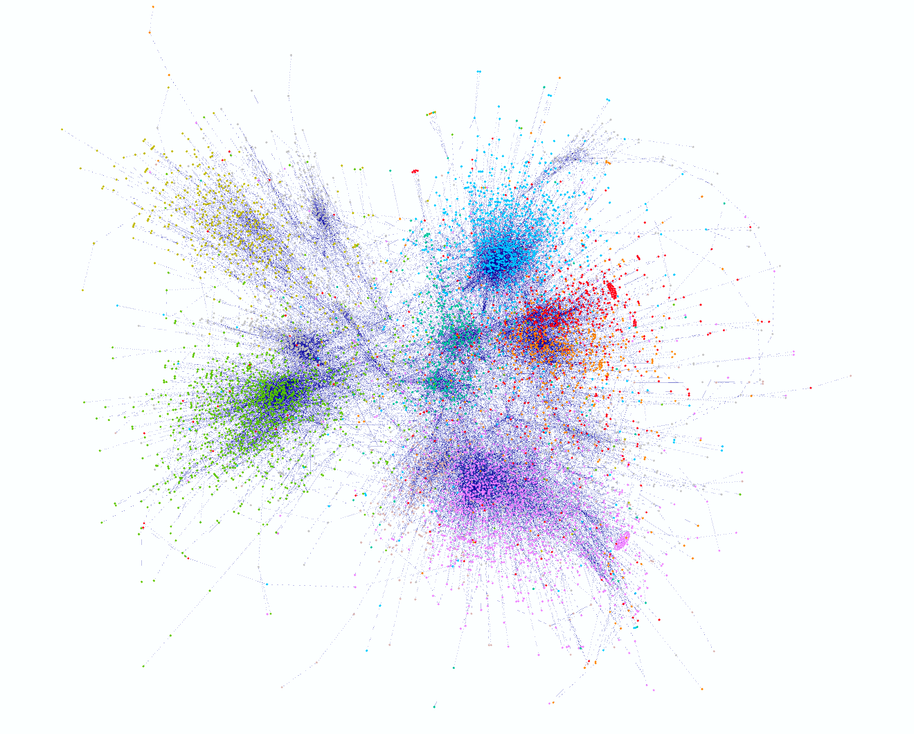
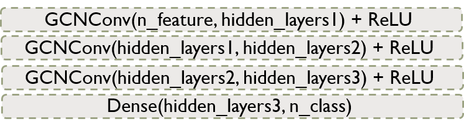
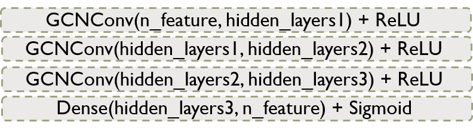

# Unlocking the Musical Map of LastFM Asia: Evidence from Graph Neural Network

We dive into a social network of [LastFM](https://www.last.fm/), an online music database and music social network platform, and explore user music tastes using [Graph Neural Network](https://ieeexplore.ieee.org/document/4700287) (GNN). We are interested in building a user-user and user-artist recommendation system, and explaining our recommendations with a GNN interpretation tool, [GNNExplainer](https://proceedings.neurips.cc/paper/2019/file/d80b7040b773199015de6d3b4293c8ff-Paper.pdf).

# 

**Data** [[Link](https://github.com/benedekrozemberczki/datasets#lastfm-asia-social-network)]: A social network of LastFM users collected from the public API in March 2020. 

**Graph dataset overview**:
* Directed graph without self-loops
* 7,624 nodes (users)
* 27,806 edges (user-user connections)
* 7,842 features (binary entries indicating whether following an artist or not)
* 18 communities (user regions)

  

**Question**:
* Q1. Friend recommendation (user-user recommendation):
  * **Can we predict a user's region based on the user feature and connections?**
  * EDA [[notebook]](https://github.com/lingyixu/CS523-Deep-Learning/blob/main/last-FM_dataset/523Dateset.ipynb) shows that users tend to connect with those from the same region. This provides supportive evidence on recommending users within the same region, at the same time showing potential opportunities connecting users from different regions.
* Q2. Content recommendation (user-artist recommendation):
  * **Can we predict a user's music taste (artist preference) based on the user's connections?**
  * Connections indicate similarity in graphs. Learning a user's connections' followed artists help undertand the user's taste.

**Model architecture**:
* General architecture: `input` -> `graph encoder` -> `node embedding` -> `classifier` -> `output`   
  * Q1. Region predtion: GNN-based multi-class classification.   
    

  * Q2. Feature prediction: GNN-based multi-label classification.   
    

**Training strategy**:
* Cross validation: randomly divide the nodes into 5 non-overlapping folds. Train:test = 4:1 in each fold.
* Weight decay: apply a small L2 regularization to compress large weights in case of overfitting.

**Progress**:
* As of April 18, 2023:
  * Update with cross validation: [notebook](https://github.com/lingyixu/CS523-Deep-Learning/blob/main/GNN/GCN_Multilabel_Classification_5Fold_CV.ipynb)
  * Update with other graph convolutaional methods: [GAT](https://github.com/lingyixu/CS523-Deep-Learning/blob/main/GNN/GAT_Multilabel_Classification_5Fold_CV.ipynb)
  * Update with benchmark graph model interpretation approach: edge weights with GAT
* As of April 5, 2023:
  * Multi-class classification accuracy [[notebook]](https://github.com/lingyixu/CS523-Deep-Learning/blob/main/GNN/GCN_Multiclass_Classification.ipynb): 80.85% 
  * Multi-label classification accuracy (with [Hamming Distance](https://torchmetrics.readthedocs.io/en/stable/classification/hamming_distance.html)) [[notebook]](https://github.com/lingyixu/CS523-Deep-Learning/blob/main/GNN/GCN_Multilabel_Classification.ipynb): 94.91%

**To-do**:
* Try more GNN architectures
* Apply GNNExplainer to explain model predictions

# 

### References:
* Scarselli, F., Gori, M., Tsoi, A. C., Hagenbuchner, M., & Monfardini, G. (2008). The graph neural network model. _IEEE transactions on neural networks_, 20(1), 61-80.
* Ying, Z., Bourgeois, D., You, J., Zitnik, M., & Leskovec, J. (2019). Gnnexplainer: Generating explanations for graph neural networks. _Advances in neural information processing systems_, 32.
* Rozemberczki, B., & Sarkar, R. (2020, October). Characteristic functions on graphs: Birds of a feather, from statistical descriptors to parametric models. In _Proceedings of the 29th ACM international conference on information & knowledge management_ (pp. 1325-1334).
