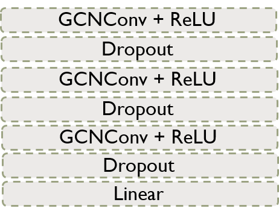
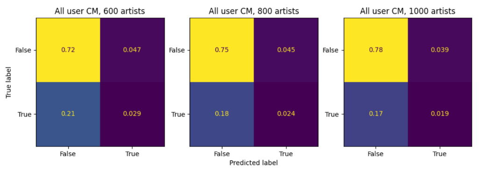
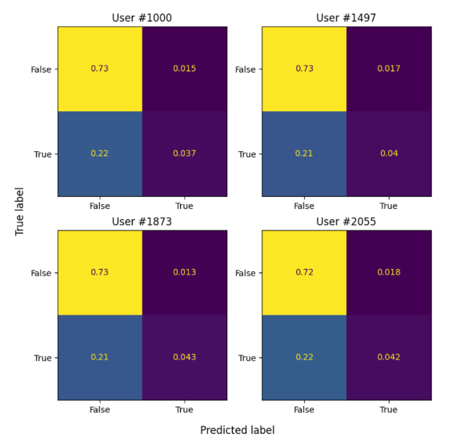

# Unlocking the Musical Map of LastFM Asia: Evidence from Graph Neural Network

We dive into a social network of [LastFM](https://www.last.fm/), an online music database and music social network platform, and explore user music tastes using [Graph Neural Network](https://ieeexplore.ieee.org/document/4700287) (GNN). We are interested in building a user-user and user-artist recommendation system, and explaining our recommendations with GNN interpretation tools, [GAT](https://arxiv.org/abs/1710.10903) and [_GNNExplainer_](https://proceedings.neurips.cc/paper/2019/file/d80b7040b773199015de6d3b4293c8ff-Paper.pdf).

# 

### GitHub code overview:
**Data**:   
* Raw data: [last-FM_dataset](https://github.com/lingyixu/CS523-Deep-Learning/tree/main/last-FM_dataset)
* Data processing and EDA: [notebook](https://github.com/lingyixu/CS523-Deep-Learning/blob/main/last-FM_dataset/523Dateset.ipynb)

**Model**:
* Region prediction GCN: [notebook](https://github.com/lingyixu/CS523-Deep-Learning/blob/main/GNN/GCN_Multiclass_Classification_5Fold_CV.ipynb)
* Region prediction MLP: [notebook](https://github.com/lingyixu/CS523-Deep-Learning/blob/main/Non_Graph_NN/MLP_Multiclass_Classification_5Fold_CV.ipynb)
* Artist prediction GCN: [GCN_1000](https://github.com/lingyixu/CS523-Deep-Learning/blob/main/GNN/GCN_Multilabel_Classification_5Fold_CV_1000.ipynb), [GCN_800](https://github.com/lingyixu/CS523-Deep-Learning/blob/main/GNN/GCN_Multilabel_Classification_5Fold_CV_800.ipynb), [GCN_600](https://github.com/lingyixu/CS523-Deep-Learning/blob/main/GNN/GCN_Multilabel_Classification_5Fold_CV_600.ipynb)
* Artist prediction GAT: [GAT_1000](https://github.com/lingyixu/CS523-Deep-Learning/blob/main/GNN/GAT_Multilabel_Classification_5Fold_CV_1000.ipynb), [GAT_800](https://github.com/lingyixu/CS523-Deep-Learning/blob/main/GNN/GAT_Multilabel_Classification_5Fold_CV_800.ipynb), [GAT_600](https://github.com/lingyixu/CS523-Deep-Learning/blob/main/GNN/GAT_Multilabel_Classification_5Fold_CV_600.ipynb), [GAT_multihead_600](https://github.com/lingyixu/CS523-Deep-Learning/blob/main/GNN/GAT_Multihead_Multilabel_Classification_5Fold_CV_600.ipynb)

**Evaluation**: [notebook](https://github.com/lingyixu/CS523-Deep-Learning/blob/main/GCN_Multilabel_Classification_Confusion_Matrix.ipynb)

**_GNNExplainer_**:
* Region prediction: [notebook](https://github.com/lingyixu/CS523-Deep-Learning/blob/main/GNNExplain/Explainer_of_%20GCN_Region_Classification.ipynb)
* Artist prediction: [notebook](https://github.com/lingyixu/CS523-Deep-Learning/blob/main/GNNExplain/GNNExplainer.ipynb)

#

## Paper overview

**Data** [[Link](https://github.com/benedekrozemberczki/datasets#lastfm-asia-social-network)]: A social network of LastFM users collected from the public API in March 2020. 

**Graph dataset overview**:
* Directed graph without self-loops
* 7,624 nodes (users)
* 27,806 edges (user-user connections)
* 7,842 features (binary entries indicating whether following an artist or not)
* 18 communities (user regions)

  

#

**Question**:
* Q1. Friend recommendation (user-user recommendation):
  * **Can we predict a user's region based on the user feature and connections?**
  * EDA [[notebook]](https://github.com/lingyixu/CS523-Deep-Learning/blob/main/last-FM_dataset/523Dateset.ipynb) shows that users tend to connect with those from the same region. This provides supportive evidence on recommending users within the same region, at the same time showing potential opportunities connecting users from different regions.
* Q2. Content recommendation (user-artist recommendation):
  * **Can we predict a user's music taste (artist preference) based on the user's connections?**
  * Connections indicate similarity in graphs. Learning a user's connections' followed artists help undertand the user's taste.

#

**Model architecture**:
* General architecture: `input` -> `graph encoder` -> `node embedding` -> `classifier` -> `output`   
  * Q1. Region predtion: GNN-based multi-class classification (left), Benchmark: MLP (right)   
    
     &nbsp;
    

  * Q2. Artist prediction: GNN-based multi-label classification.   
    
    

#

**Training strategy**:
* **Cross validation**: randomly divide the nodes into 5 non-overlapping folds. Train:test = 4:1 in each fold.
* **Regularization**: use L2 regularization (weight decay) to compress large weights in case of overfitting.
* **Hyperparameter tuning**: implement grid-search for combinations of learning rate, weight decay, number of epochs, and number of nodes in each graph and fully connected layer of the models.
* **Masking**: prevent information leakage during message passing while making the best use of all available information. See a visualized explanation below.   
  

  
  

  
#
**Results**:
* Overall model performance:   
  
  

  
  

* Individual predictions of randomly picked users:   
  

  
  

#

**Model interpretation**:
* **Edge importance**: self-attention scores learned by GAT.    
  See a visualization for node (user) #1005 below, where arrows indicate edge directions and edge thinkness indicate level of importance.   
  

  
  

* **Feature importance**: a subset of features that contribute most to model predictions learned by _GNNExplainer_.    
  See feature importance visualization for the overall dataset (left) and randomly picked individual users (right) below.   
  
  

  
  
  

# 

### References:
* Scarselli, F., Gori, M., Tsoi, A. C., Hagenbuchner, M., & Monfardini, G. (2008). The graph neural network model. _IEEE transactions on neural networks_, 20(1), 61-80.
* Veličković, P., Cucurull, G., Casanova, A., Romero, A., Lio, P., & Bengio, Y. (2017). Graph attention networks. _arXiv preprint_ arXiv:1710.10903.
* Ying, Z., Bourgeois, D., You, J., Zitnik, M., & Leskovec, J. (2019). Gnnexplainer: Generating explanations for graph neural networks. _Advances in neural information processing systems_, 32.
* Rozemberczki, B., & Sarkar, R. (2020, October). Characteristic functions on graphs: Birds of a feather, from statistical descriptors to parametric models. In _Proceedings of the 29th ACM international conference on information & knowledge management_ (pp. 1325-1334).
